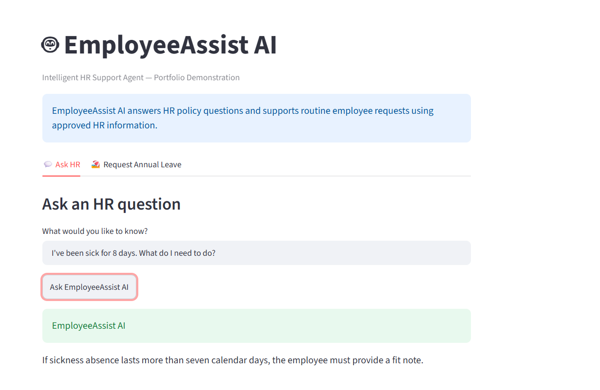
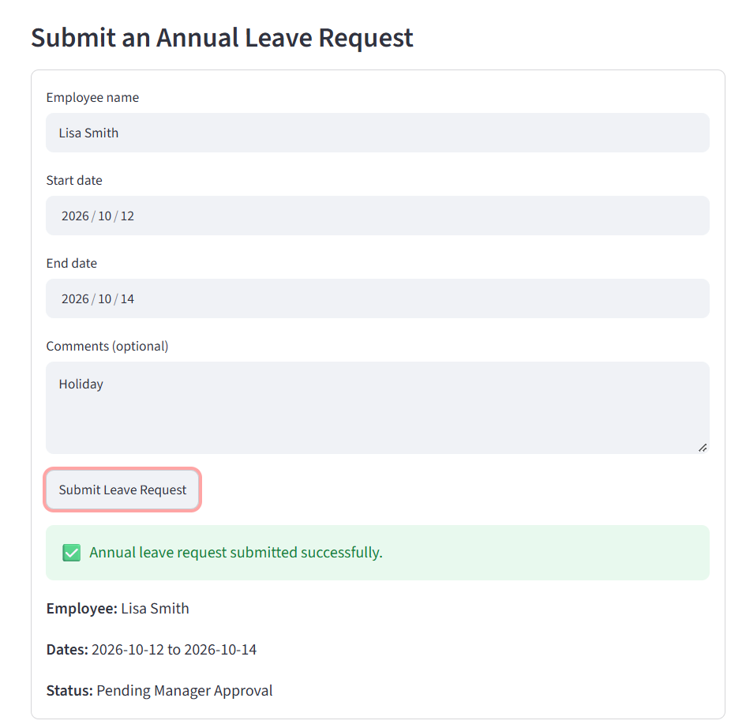
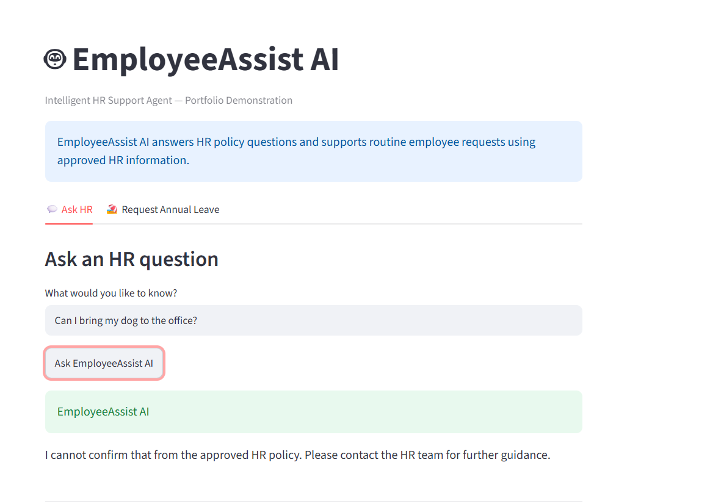

# 🤖 EmployeeAssist AI

**Intelligent HR Support Agent — AI Engineer Portfolio Project**

EmployeeAssist AI is an AI-powered HR support application designed to answer employee policy questions and automate routine HR requests.

The project demonstrates practical AI engineering concepts including semantic search, policy-grounded responses, guardrails, workflow automation, structured data capture, and a Streamlit user interface.

> **Portfolio demonstration:** This project uses fictional Contoso Services HR policies and does not contain real employee information.

---

## 🎯 Business Problem

HR teams frequently receive repetitive questions about annual leave, sickness absence, hybrid working and company policies.

EmployeeAssist AI demonstrates how an AI-powered employee support solution can provide employees with quick answers while reducing repetitive HR administration.

---

## ✨ Key Features

### 💬 HR Policy Assistant

Employees can ask natural-language questions about company HR policies.

Example:

> "I've been sick for 8 days. What do I need to do?"

The application searches the approved HR policy knowledge base and returns the most relevant information.

### 🧠 Semantic Search

The application uses sentence embeddings and similarity matching to identify relevant HR policy content based on the meaning of the employee's question rather than relying only on exact keyword matches.

### 🛡️ Guardrails and Fallback Handling

The assistant is designed not to invent unsupported company policies.

For example:

> "Can I bring my dog to the office?"

If the answer cannot be supported by the approved HR knowledge, the assistant directs the employee to HR rather than fabricating a policy.

### 🏖️ Annual Leave Request Workflow

Employees can submit an annual leave request through a structured form containing:

- Employee name
- Start date
- End date
- Optional comments

The request is recorded with a **Pending Manager Approval** status, demonstrating how conversational AI can be combined with business workflows.

---

## 🖼️ Application Screenshots

### HR Policy Question



### Annual Leave Request



### Guardrail / Unsupported Policy Question



---

## 🏗️ Solution Architecture

```text
                    Employee
                        │
                        ▼
                 Streamlit UI
                        │
             ┌──────────┴──────────┐
             │                     │
             ▼                     ▼
      HR Policy Question      Leave Request
             │                     │
             ▼                     ▼
       Semantic Search       Input Validation
             │                     │
             ▼                     ▼
     Sentence Embeddings      Request Logging
             │                     │
             ▼                     ▼
     HR Policy Knowledge     Pending Approval
             │
             ▼
   Relevant Policy Response
             │
       ┌─────┴─────┐
       │           │
    Supported   Unsupported
       │           │
       ▼           ▼
 Policy Answer   HR Escalation
```

---

## 🧰 Technology Stack

- **Python**
- **Streamlit** — interactive web application
- **Sentence Transformers** — semantic text embeddings
- **Scikit-learn** — similarity calculation
- **CSV** — demonstration workflow storage
- **Git & GitHub** — source control and portfolio hosting

---

## 📁 Project Structure

```text
employee-assist-ai/
│
├── app.py
├── requirements.txt
├── README.md
├── .gitignore
│
├── data/
│   └── hr_policy.txt
│
└── screenshots/
    ├── hr-question.png
    ├── leave-request.png
    └── fallback.png
```

---

## 🚀 Running the Application Locally

Clone the repository:

```bash
git clone https://github.com/SharminAman/employee-assist-ai.git
cd employee-assist-ai
```

Create and activate a virtual environment, then install the dependencies:

```bash
pip install -r requirements.txt
```

Run the Streamlit application:

```bash
streamlit run app.py
```

Streamlit will open the EmployeeAssist AI interface in your browser.

---

## 🧪 Example Test Scenarios

| Scenario | Expected Behaviour |
|---|---|
| Annual leave entitlement | Returns information from the approved HR policy |
| Sickness lasting more than 7 days | Provides the relevant fit-note guidance |
| Unsupported company-policy question | Does not invent an answer and directs the user to HR |
| Annual leave request | Captures the request and returns a pending approval status |

---

## 🔐 Responsible AI Considerations

The prototype demonstrates several basic responsible-AI principles:

- Answers should be grounded in approved HR information.
- Unsupported policy questions should not result in fabricated answers.
- Employees should not be asked for unnecessary sensitive information.
- Complex HR matters should be escalated to a human HR team.
- The application is a portfolio prototype and not a production HR decision-making system.

---

## 🔮 Future Improvements

Future development could include:

- Retrieval-Augmented Generation (RAG) with a production vector database
- LLM-generated responses grounded in retrieved policy content
- Microsoft Copilot Studio integration
- Power Automate approval workflows
- Microsoft Teams integration
- Authentication and role-based access
- SharePoint or Dataverse knowledge sources
- Manager approval notifications
- Cloud deployment
- Conversation logging and evaluation

---

## 👤 Author

**Sharmin Aman**

AI Engineer Portfolio Project

---

## ⚠️ Disclaimer

EmployeeAssist AI is a fictional portfolio demonstration. Contoso Services and the HR policies used in this project are fictional. The application should not be used for real employment, HR, legal or medical decisions.